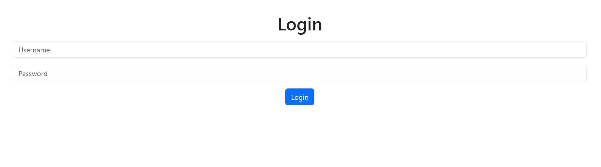
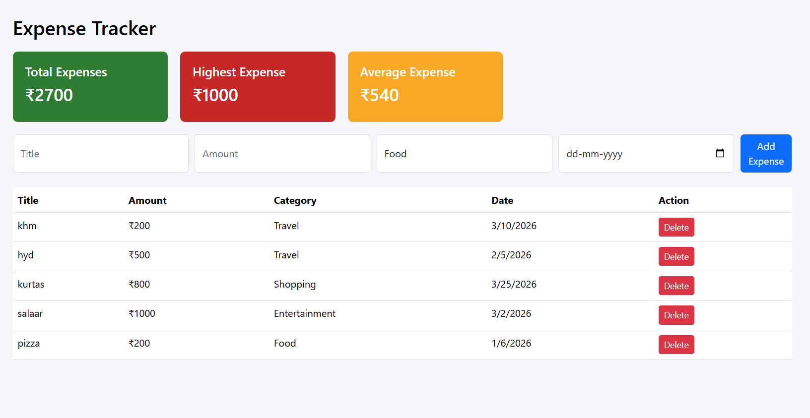
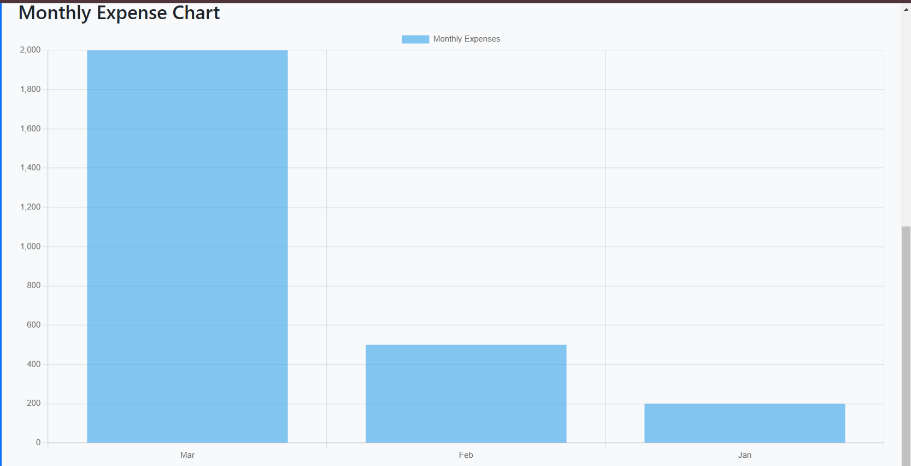

# Expense Tracker Web Application

A full-stack expense tracking application that helps users manage and analyze their daily expenses.

## Tech Stack
Frontend: React.js  
Backend: Node.js + Express.js  
Database: MySQL  
Charts: Chart.js  
Version Control: Git + GitHub

## Features
- User Login System
- Add Expenses
- Edit Expenses
- Delete Expenses
- Expense Categories
- Dashboard Analytics
- Monthly Expense Chart
- Dark Mode Toggle

## Project Structure
frontend → React UI  
Backend → Node.js API  
database → MySQL

## How to Run

Backend:
cd Backend  
npm install  
node server.js  

Frontend:
cd frontend  
npm install  
npm start

## Author
Divya
## Project Screenshots

  
  

  
  

